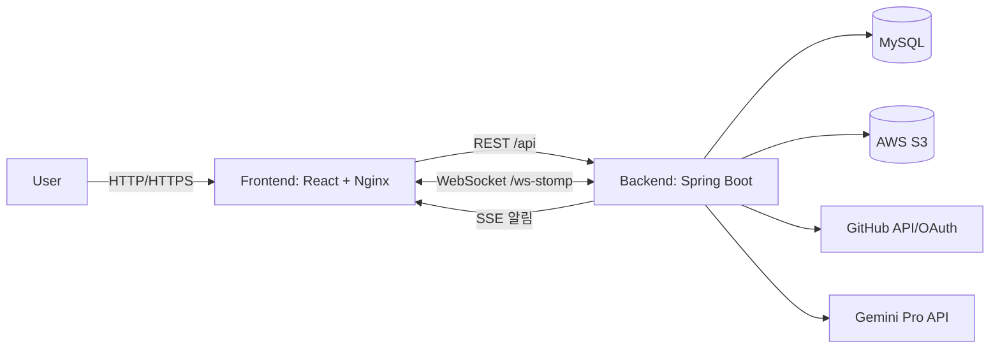

# LinkLogMate (LLM)

> **GitHub 연동으로 시작하고, AI로 완성하는 협업 프로젝트 관리 시스템**  
> 코드(Commit)·이슈(Issue)·업무(Task)·보고서(Report)를 한 곳에서 관리하고, **AI가 일일/최종 보고서를 자동 생성**합니다.

- Backend (Spring Boot): `LLMSpring` (dev)  
- Frontend (React): `LLMReact` (dev)
- 프로젝트 수행 기간(계획): **2026.01.09 ~ 2026.02.09**
- https://github.com/sgn08062/LLMReact 에서 프로젝트 최종 마무리 후 각 개인 프로젝트로 Fork한 버전입니다.
- 각 개인 환경에 따라 달라질 수 있습니다.  
---

## 목차

- [프로젝트 소개](#프로젝트-소개)
- [핵심 기능](#핵심-기능)
- [시스템 아키텍처](#시스템-아키텍처)
- [기술 스택](#기술-스택)
- [빠른 시작](#빠른-시작)
  - [로컬 실행](#로컬-실행)
  - [Docker로 실행](#docker로-실행)
- [환경변수/설정](#환경변수설정)
- [API 엔드포인트](#api-엔드포인트)
- [트러블슈팅](#트러블슈팅)
- [팀/역할](#팀역할)

---

## 프로젝트 소개

현대 개발 환경에서 **GitHub(코드/커밋/이슈)** 와 **관리 도구(Jira/Notion 등)** 가 분리되면 정보가 파편화되고, 개발자는 **보고서 작성**에 많은 시간을 소모하게 됩니다.  
**LinkLogMate**는 GitHub 활동 내역을 기반으로 프로젝트 진행 현황을 자동으로 추적하고, **AI(Gemini Pro)** 로 보고서를 자동 생성하여 **“개발자는 개발에만 집중”** 할 수 있도록 돕는 올인원 협업 플랫폼입니다.

---

## 핵심 기능

### 1) GitHub 연동 & 데이터 동기화
- 프로젝트 생성 시 **GitHub Repository / Branch** 를 선택하여 연결
- 커밋(Commit)·PR·이슈 데이터를 동기화하여 프로젝트 활동을 자동 수집
- 팀원별 커밋 통계를 바탕으로 **기여도 시각화**

### 2) 프로젝트 관리
- 프로젝트 생성/수정/상태 변경(DONE/복구)/삭제(Soft Delete)
- 대시보드: 진행률/최근 활동/기여도 기반 통계 제공
- 멤버 관리: **OWNER / ADMIN / MEMBER** 권한 기반 역할 관리
- 멤버 초대/수락/거절 프로세스

### 3) 업무(Task) 관리 (Kanban)
- Todo / In Progress / Done 기반 **칸반 보드**
- Drag & Drop 기반 상태 변경
- 담당자 할당, 마감일/우선순위, 체크리스트, 활동 로그
- Task별 전용 채팅(문맥 기반 소통)

### 4) 이슈(Issue) 관리
- 이슈 등록/수정/아카이브, 담당자 할당
- 상태/우선순위/기간/담당자 등 다양한 조건으로 필터링
- GitHub 커밋 SHA/메시지/URL과 매핑

### 5) AI 자동 보고서 (Daily / Final)
- **일일 보고서(Daily Report)**  
  - GitHub 커밋 로그 기반 요약/정리
  - 커밋 통계 자동 집계
  - AI 채팅으로 “문장 다듬기/요약 보강/회고 질문” 등 지원
- **최종 보고서(Final Report)**  
  - 프로젝트 히스토리(커밋/이슈/리포트)를 종합하여 자동 초안 생성
  - 섹션 선택 기반 생성, 수정/다른 이름으로 저장

### 6) 실시간 협업
- **WebSocket(STOMP)**: 업무/이슈 맥락 기반 채팅
- **SSE(Server-Sent Events)**: 초대/할당/댓글 등 주요 이벤트 실시간 알림(단방향 푸시)

### 7) 인증/보안
- 자체 회원가입/로그인 + GitHub OAuth 연동
- JWT **Access/Refresh** 기반 인증 및 재발급
- GitHub 토큰 암호화(양방향 암호화 키 사용)

---

## 시스템 아키텍처

> GitHub 상에서 Mermaid 렌더링을 지원합니다.



---

## 기술 스택

### Frontend (LLMReact)
- React (CRA)
- react-router-dom
- SockJS + STOMP (WebSocket)
- Toast UI Editor
- Recharts
- framer-motion

### Backend (LLMSpring)
- Java 17 / Spring Boot 3
- Spring Web / WebSocket / Actuator
- Spring Data JPA + MyBatis
- Spring Security + OAuth2 Client
- JWT / BCrypt
- AWS S3 (spring-cloud-aws)

### DB / Infra
- MySQL
- Docker, Nginx  
- (배포) AWS ECS 기반 운영 구성

---

## 빠른 시작

### 로컬 실행

#### 1) Backend (LLMSpring)
```bash
git clone -b main https://github.com/cutiepepe2926/LLMSpring.git
cd LLMSpring

# (선택) 테스트 제외 빌드
./gradlew clean build -x test

# 실행
./gradlew bootRun
```

- 기본 포트: `8080` (Spring 기본값)
- DB는 MySQL 8.x 기준으로 준비해주세요. (예: `localhost:3306`)

#### 2) Frontend (LLMReact)
```bash
git clone -b main https://github.com/cutiepepe2926/LLMReact.git
cd LLMReact

npm ci
npm start
```

> ⚠️ 현재 프론트의 API 래퍼는 `BASE_URL=""`(동일 Origin) 기준입니다.  
> 로컬 개발에서 프론트(3000) → 백엔드(8080) 호출을 하려면 아래 중 한 가지를 권장합니다.
> 1) `src/utils/api.js`의 `BASE_URL`을 `http://localhost:8080`으로 설정  
> 2) CRA 프록시 설정(예: `package.json`에 `"proxy": "http://localhost:8080"` 추가)

---

### Docker로 실행

LLMReact는 멀티 스테이지 빌드 후 Nginx로 정적 파일을 서빙하며, `/api`, `/ws-stomp`, `/oauth2`, `/login/oauth2` 경로를 백엔드로 프록시합니다.  
따라서 운영 환경에서는 **CORS 이슈 없이 동일 도메인에서** 프론트/백엔드가 동작하도록 구성할 수 있습니다.

#### docker-compose 예시

> ✅ 전제: 같은 상위 폴더에서 `LLMSpring/`과 `LLMReact/`를 각각 클론한 뒤 실행합니다. (compose의 `context:` 경로가 이를 기준으로 작성되어 있습니다.)

> 아래는 **예시**입니다. (서비스명/포트/환경변수는 환경에 맞게 조정하세요.)  
> 특히 Nginx 설정에서 백엔드 호스트를 `backend-container:8080`으로 바라보므로, compose에서 해당 서비스명(또는 network alias)을 맞추는 것을 권장합니다.

```yaml
services:
  backend-container:
    build:
      context: ./LLMSpring
    ports:
      - "8080:8080"
    environment:
      DB_NAME: your_db
      DB_USERNAME: your_user
      DB_PASSWORD: your_pass
      JWT_SECRET_KEY: your_jwt_secret
      TWO_WAY_ENCRYPTION: your_encrypt_key
      GITHUB_CLIENT_ID: your_github_client_id
      GITHUB_CLIENT_SECRET: your_github_client_secret
      GEMINI_API: your_gemini_api_key
      AWS_ACCESS_KEY: your_aws_access_key
      AWS_SECRET_KEY: your_aws_secret_key
      AWS_BUCKET_NAME: your_bucket
      APP_FRONTEND_URL: "http://localhost" # app.frontend.url 매핑
  frontend-container:
    build:
      context: ./LLMReact
    ports:
      - "80:80"
    depends_on:
      - backend-container
```

---

## 환경변수/설정

### Backend 필수 환경변수

아래 값들은 `LLMSpring/src/main/resources/application.properties` 에서 참조됩니다.

- `DB_NAME`, `DB_USERNAME`, `DB_PASSWORD`
- `JWT_SECRET_KEY` (Access/Refresh 토큰 서명 키)
- `TWO_WAY_ENCRYPTION` (GitHub 토큰 암호화 키)
- `GITHUB_CLIENT_ID`, `GITHUB_CLIENT_SECRET`
- `GEMINI_API` (Gemini Pro API Key)
- `AWS_ACCESS_KEY`, `AWS_SECRET_KEY`, `AWS_BUCKET_NAME`
- `APP_FRONTEND_URL` → `app.frontend.url` 로 바인딩되어 CORS/리다이렉트에 사용

### GitHub OAuth 설정 체크리스트
- GitHub OAuth App 생성 후 Client ID/Secret 발급
- Callback URL 예시:
  - 로컬: `http://localhost:8080/login/oauth2/code/github`
  - 운영: `https://{your-domain}/login/oauth2/code/github`

---

## API 엔드포인트

> 대표적인 엔드포인트만 발췌했습니다. (자세한 API 명세는 별도 문서화 권장)

### Auth
- `POST /api/auth/signUp`
- `POST /api/auth/logIn`
- `POST /api/auth/reissue`
- `GET  /api/auth/validate`

### Project
- `POST   /api/projects`
- `GET    /api/projects`
- `GET    /api/projects/{projectId}`
- `PUT    /api/projects/{projectId}`
- `PATCH  /api/projects/{projectId}/status`
- `DELETE /api/projects/{projectId}`
- `POST   /api/projects/{projectId}/restore`
- `GET    /api/projects/{projectId}/dashboard`

### Issue
- `POST   /api/projects/{projectId}/issues`
- `GET    /api/projects/{projectId}/issues`
- `GET    /api/projects/{projectId}/issues/{issueId}`
- `PATCH  /api/projects/{projectId}/issues/{issueId}`
- `DELETE /api/projects/{projectId}/issues/{issueId}`
- `POST   /api/projects/{projectId}/issues/{issueId}/assignees`
- `DELETE /api/projects/{projectId}/issues/{issueId}/assignees/{userId}`

### Daily / Final Report
- `POST /api/projects/{projectId}/today`
- `POST /api/projects/{projectId}/daily-reports/analyze`
- `GET  /api/projects/{projectId}/daily-reports?date=YYYY-MM-DD`
- `POST /api/projects/{projectId}/daily-reports/{reportId}/chat`
- `GET  /api/projects/{projectId}/stats?period=weekly|monthly`
- `POST /api/projects/{projectId}/final-reports`
- `GET  /api/projects/{projectId}/final-reports`
- `PUT  /api/projects/{projectId}/final-reports/{finalReportId}`

---

## 트러블슈팅

- **에디터(리포트 작성) 페이지에서 뒤로가기 시 흰 화면/멈춤**  
  - 원인: DOM removeChild 관련 에러(NotFoundError)  
  - 대응: 에디터 컴포넌트를 React 관리 영역에서 격리하고 라이프사이클에 맞춰 정리(Isolation + 메모리 정리)

- **이슈 트래커의 복잡한 필터 조합 처리**  
  - 수십 개 조건문 대신 MyBatis Dynamic SQL(`<if>`, `<choose>`, `<where>`)로 단일 쿼리에서 유연하게 처리

- **실시간 기능 설계: 채팅/알림 모두 WebSocket?**  
  - 채팅은 양방향(WebSocket), 알림은 단방향(SSE)로 분리해 서버 리소스를 최적화

---

## 팀/역할

- **강승태**
  - DB(Task, Daily Report), WebSocket/Task/DailyReport/Alarm API, Toast Notification, UI
- **이건희**
  - DB(Project, Issue), Project/Issue/GitHub/Member/Scheduler/Alarm API, UI
- **이경훈**
  - DB(User, Final Report), Auth/User/FinalReport/S3/JWT/Alarm/GitHub API, CI/CD(AWS 배포), UI

---

## Repositories

- Backend: https://github.com/sgn08062/LLMSpring/tree/dev
- Frontend: https://github.com/sgn08062/LLMReact/tree/dev
